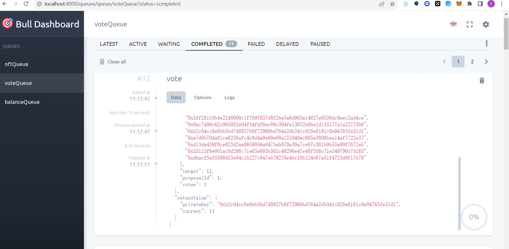

# 步骤

## 安装项目依赖: 

```
pnpm install
```

## 启动mysql和redis服务

1. mysql: 略
2. redis: 执行以下终端命令
```
docker compose up -d
```

## 编辑.env文件(.env.local)，根据实际情况填写mysql和redis的配置参数值。

## 启动nestjs服务
```
pnpm run start
```

# 使用示例

1. api文档: ``` http:127.0.0.1:4000/api ```

2. bull-board: ``` http:127.0.0.1:4000/queues ```

3. init请求:
```
### Send POST request with json body
POST http://localhost:4000/init
Content-Type: application/json

{
  "networkId": 31337,
  "networkName": "localhost",
  "networkProviderUrl": "http://127.0.0.1:8545/",
  "mnemonic": "test test test test test test test test test test test junk",
  "childWalletAmount": 20,
  "TransferAmount": 10
}
```
此请求将区块链网络信息存入数据库，通过助记词生成父钱包以及指定数量的子钱包，同时存入数据库，最后父钱包向每个子钱包转指定数量的ETH，并将钱包的余额信息存入数据库。

响应信息如下:

```
{
  "networkInfo": {
    "id": 31337,
    "name": "localhost",
    "url": "http://127.0.0.1:8545/",
    "deletedAt": null,
    "createdAt": "2023-10-13T02:34:40.834Z",
    "updatedAt": "2023-10-13T02:34:40.834Z",
    "deleted": 0
  },
  "walletInfo": {
    "parent": {
      "mnemonic": "test test test test test test test test test test test junk",
      "privateKey": "0xac0974bec39a17e36ba4a6b4d238ff944bacb478cbed5efcae784d7bf4f2ff80",
      "address": "0xf39Fd6e51aad88F6F4ce6aB8827279cffFb92266"
    },
    "children": [
      {
        "index": 0,
        "privateKey": "0x7158c272e1b62a9a6e90141fc579a0fdccac55a4baf11c03b7791bcf89f787bc",
        "address": "0xD89879B78BE8197b7e8eeb070467292129F42e8d"
      },
      {
        "index": 1,
        "privateKey": "0x128a49deb115e7fa1bbdb1c91f380db8746824f03235175c47075fcd9321ffb9",
        "address": "0xE84024429b54117a3E5075D64e0e6556e4550841"
      },
      {
        "index": 2,
        "privateKey": "0xe76af4a8a18472dc4f845009ce7c5283dcf8577307b202c856e96b8b5025327f",
        "address": "0xB9386756C2A696CA99022c10f38f0d9CAaE2dC5d"
      },
      {
        "index": 3,
        "privateKey": "0x4120eedf9afcfc699a964fc8bb993c91daf9a3f3e3ec12fd75a038143f2fc0a6",
        "address": "0xe41543832C14489f331B580b17b1c9685baB006a"
      },
      {
        "index": 4,
        "privateKey": "0x8a4137169ddab644388797795753071f806f975ad97f7627aac295f983eac8b3",
        "address": "0x4a75D77bfB83c1F47Cd1d66B8cddB1FD37dd16b0"
      },
      {
        "index": 5,
        "privateKey": "0x312dfce5c4d3e0e851dafe388ed25d0c6a72a72365e72ee463ee083f0901c0fb",
        "address": "0x6cf94787691569aF90dc09a42855f616130BC402"
      },
      {
        "index": 6,
        "privateKey": "0x5ff261b3b4e2248000c1f7697637d8f2be3a6d963a14627e9538dc9eec2ad4ce",
        "address": "0xc1D3D9718d7481f31837f8278Ec1a711b0622F5A"
      },
      {
        "index": 7,
        "privateKey": "0x8ac7d99c62c065932e04f34fdf6ec89c394fe13072b6be1d135177a1a22775b6",
        "address": "0x8BfC4bA08AE5dA77dF01d7Be6F604cA4E5c3B7B2"
      },
      {
        "index": 8,
        "privateKey": "0x722337a68869ef9fad50f2b002ff11ad62d6a39c563bba49ea841da958867db6",
        "address": "0x80D2Fb65A0350b86FfB23e2ACc275549cbAcCD50"
      },
      {
        "index": 9,
        "privateKey": "0xb2c04cc8e6bb5bd7d8927b8f72960bd764a2db341c028e6181c0e94763fe31d1",
        "address": "0xa621224B3E0DB071062a63fbdB6C072fEAf54849"
      },
      {
        "index": 10,
        "privateKey": "0xe7d6b70da81ce6256afc4c0d4a0e60e68a151940ec685e3808bea14af7722e37",
        "address": "0xf0028bEB1f8C5210B3Eee246271a5a1042C0dE22"
      },
      {
        "index": 11,
        "privateKey": "0x6568f9e63ffaaaa90ea01204ddee30c7f39b899cc94bd55a1e0daa92d738b8c9",
        "address": "0x204d7eDc89CC5451c8e2190B03D8B6F9aa0178C8"
      },
      {
        "index": 12,
        "privateKey": "0x2ada08d75aaeb1be7082e6e113d2c24a9d4e133f8395f5b7fc2148ab5e1c6bf8",
        "address": "0xf05C734B12626d9C60390dAcd05F1d55234021bd"
      },
      {
        "index": 13,
        "privateKey": "0xd13da459f0ce623d2ae0659056a8475ab070e30a7ce07c361b0b55a80f7672eb",
        "address": "0x2075e630B567C5eE339fc3E3d0Fc0B18F32fD1dC"
      },
      {
        "index": 14,
        "privateKey": "0xb9407b90bde8cd6103326edfe69f4ada32bae605e8ed28fe2436f90b535c32bf",
        "address": "0x6806D15263F66158D5bb72E3fB7441e16e9194A2"
      },
      {
        "index": 15,
        "privateKey": "0x43fcb7f71d7f615544407a8dd9c3cddcb76b55efcbb46f403cacef34766578c2",
        "address": "0x679ee04d757397aEAFafBE4B620d71E26aFBBaE1"
      },
      {
        "index": 16,
        "privateKey": "0xdbc1f6c9cbcf0a9f85bc61299b1ee1ad3f652743629b627c19f7e7fb24b384b5",
        "address": "0x94F676C550faEbc6B7C7772eF397C205b1aefC60"
      },
      {
        "index": 17,
        "privateKey": "0xeb46eb2d58e6511910892f9a24ecb48370ac9376167609be6271a31705c326f3",
        "address": "0x36c9B2CEdb3010EB4faD4Ae24d1C1362e3C1B575"
      },
      {
        "index": 18,
        "privateKey": "0x53115f6e601ac8d266c71e63e685b561c48206e47e48f356c71e349790c7d163",
        "address": "0x6ecB9Af45661Eb3308da55882b91F9c2E4638CBB"
      },
      {
        "index": 19,
        "privateKey": "0xdbacf3ef5390d53e64c1b227c947eb79278e4bc18b124b67a51f4723d9f17b79",
        "address": "0xE4EA9a2c1556B9873aB99E7D162a767C5407deD4"
      }
    ]
  }
}
```

4. mint job


如上图所示，其中lists为白名单的csv文件，示例如下:
```
0xf39Fd6e51aad88F6F4ce6aB8827279cffFb92266,10
0xD89879B78BE8197b7e8eeb070467292129F42e8d,10
0xE84024429b54117a3E5075D64e0e6556e4550841,10
0xB9386756C2A696CA99022c10f38f0d9CAaE2dC5d,10
0xe41543832C14489f331B580b17b1c9685baB006a,10
0x4a75D77bfB83c1F47Cd1d66B8cddB1FD37dd16b0,10
0x6cf94787691569aF90dc09a42855f616130BC402,10
0xc1D3D9718d7481f31837f8278Ec1a711b0622F5A,10
0x8BfC4bA08AE5dA77dF01d7Be6F604cA4E5c3B7B2,10
0x80D2Fb65A0350b86FfB23e2ACc275549cbAcCD50,10
0xa621224B3E0DB071062a63fbdB6C072fEAf54849,10
0xf0028bEB1f8C5210B3Eee246271a5a1042C0dE22,10
0x204d7eDc89CC5451c8e2190B03D8B6F9aa0178C8,10
0xf05C734B12626d9C60390dAcd05F1d55234021bd,10
0x2075e630B567C5eE339fc3E3d0Fc0B18F32fD1dC,10
0x6806D15263F66158D5bb72E3fB7441e16e9194A2,10
0x679ee04d757397aEAFafBE4B620d71E26aFBBaE1,10
0x94F676C550faEbc6B7C7772eF397C205b1aefC60,10
0x36c9B2CEdb3010EB4faD4Ae24d1C1362e3C1B575,10
0x6ecB9Af45661Eb3308da55882b91F9c2E4638CBB,10
0xE4EA9a2c1556B9873aB99E7D162a767C5407deD4,10
```
proofs为白名单的proof json文件，示例如下:
```
[
  {
    "addr": "0xf39Fd6e51aad88F6F4ce6aB8827279cffFb92266",
    "amount": "10",
    "proof": [
      "0x2cf522445dc92017261e6c340e96df7e642d039c27ef9e7fbc24deaf0d1f383b",
      "0xd71e751839a154f695196eb117e91754d704f9543e2b88546affa74f9283bd7c",
      "0x9d09fd08181042af467fd58da5868e33e3ff9ce49eb04492e649f47b13a7d6b7",
      "0x1c977fc877ab36715f7f372963257219d04d262b2a8370a18597a7b5e9235e3d",
      "0x92dd6b9042ce5575747ca84ae1dc98a6ee4d3e49a9a5f4802880c68d103055f7"
    ]
  },
  {
    "addr": "0xD89879B78BE8197b7e8eeb070467292129F42e8d",
    "amount": "10",
    "proof": [
      "0xe135127ca87e77a15c820f2b59738a70120e9f46da138cb01e7dc46753fb0a6d",
      "0xcb6ac7cbbca406188eaa76dd5c2ac46d158d7fbd2b4e66ae79fea5910fd6336e",
      "0x877487830db2cc801f59310470a8ccda94f32004d1f2e6ff9d9cd98248630bb6",
      "0x92dd6b9042ce5575747ca84ae1dc98a6ee4d3e49a9a5f4802880c68d103055f7"
    ]
  },
  {
    "addr": "0xE84024429b54117a3E5075D64e0e6556e4550841",
    "amount": "10",
    "proof": [
      "0xc448568b617766fc58954db257da9dbf1edcaa7679c6a27fc2be8431dbe883e3",
      "0x2bbe04090d6fa06a00da00d03b5d49a90e9e29ea0d438781271408f7e5a14a30",
      "0x095853c5921e65b8a7b913cc3737c10eac95b6bb38a6f14767bff022bd22adc2",
      "0xc1ad8110393e1fea2f8bf94710be50a2dcfdde7d1ea75afd7d968e8be78e88ea"
    ]
  },
  {
    "addr": "0xB9386756C2A696CA99022c10f38f0d9CAaE2dC5d",
    "amount": "10",
    "proof": [
      "0x2e4ce87b7e52f3efb5cd836f38cfec3050e381b06ea201e53374b4abf1039a56",
      "0x74a530665c74b4e06f5dcc3e9640d0c99375be7edecf70e43bc97edfcd51047f",
      "0x9d09fd08181042af467fd58da5868e33e3ff9ce49eb04492e649f47b13a7d6b7",
      "0x1c977fc877ab36715f7f372963257219d04d262b2a8370a18597a7b5e9235e3d",
      "0x92dd6b9042ce5575747ca84ae1dc98a6ee4d3e49a9a5f4802880c68d103055f7"
    ]
  },
  {
    "addr": "0xe41543832C14489f331B580b17b1c9685baB006a",
    "amount": "10",
    "proof": [
      "0x78c6e192a67e584b1d41b142524eead11406c966637a1cc64b4889ed9f9c24ce",
      "0x9ae34303685ff7147022e1dc336788e234cbd8a809db92f92640850b61f14f4b",
      "0xa1e728e7157c682bf13236c330f33ddea689b758af00f911086878f67f1851bb",
      "0x1c977fc877ab36715f7f372963257219d04d262b2a8370a18597a7b5e9235e3d",
      "0x92dd6b9042ce5575747ca84ae1dc98a6ee4d3e49a9a5f4802880c68d103055f7"
    ]
  },
  {
    "addr": "0x4a75D77bfB83c1F47Cd1d66B8cddB1FD37dd16b0",
    "amount": "10",
    "proof": [
      "0x8ee0ab75744fde75f006a5f1a19b4447ee83ebec4cc58c27132c46e8cfe74285",
      "0x727d05989c38d902503222e40b3f2162cf7135b0c85c7f0c1764d8cbd6a0ee99",
      "0xeef34dd409aa93c9ffd306ad3d16c395c367e9f032495f2a1c1e858279cc0ca5",
      "0xc1ad8110393e1fea2f8bf94710be50a2dcfdde7d1ea75afd7d968e8be78e88ea"
    ]
  },
  {
    "addr": "0x6cf94787691569aF90dc09a42855f616130BC402",
    "amount": "10",
    "proof": [
      "0x1ef414ab6e558065d9d084842ccc69c61ae3d36b3f1b9d02733c5d724770cc2d",
      "0xd71e751839a154f695196eb117e91754d704f9543e2b88546affa74f9283bd7c",
      "0x9d09fd08181042af467fd58da5868e33e3ff9ce49eb04492e649f47b13a7d6b7",
      "0x1c977fc877ab36715f7f372963257219d04d262b2a8370a18597a7b5e9235e3d",
      "0x92dd6b9042ce5575747ca84ae1dc98a6ee4d3e49a9a5f4802880c68d103055f7"
    ]
  },
  {
    "addr": "0xc1D3D9718d7481f31837f8278Ec1a711b0622F5A",
    "amount": "10",
    "proof": [
      "0xbb26399d9af2b7b1692e5bc78e01721b81507f684c7854733e8ed3529c1395f2",
      "0x465a154d92e371344d30cc3e21934e451aa7bc3bf42229eb0e85cc82aa7ac8fa",
      "0x095853c5921e65b8a7b913cc3737c10eac95b6bb38a6f14767bff022bd22adc2",
      "0xc1ad8110393e1fea2f8bf94710be50a2dcfdde7d1ea75afd7d968e8be78e88ea"
    ]
  },
  {
    "addr": "0x8BfC4bA08AE5dA77dF01d7Be6F604cA4E5c3B7B2",
    "amount": "10",
    "proof": [
      "0x16a08d23819b66afd6b4284a000ea9e72829f911b5fd7311d27b65ffde520338",
      "0xea004adf3a9b9283ba08f51df8726498ada8a2f80734d8a5fac977f267690fd0",
      "0xcb6ac7cbbca406188eaa76dd5c2ac46d158d7fbd2b4e66ae79fea5910fd6336e",
      "0x877487830db2cc801f59310470a8ccda94f32004d1f2e6ff9d9cd98248630bb6",
      "0x92dd6b9042ce5575747ca84ae1dc98a6ee4d3e49a9a5f4802880c68d103055f7"
    ]
  },
  {
    "addr": "0x80D2Fb65A0350b86FfB23e2ACc275549cbAcCD50",
    "amount": "10",
    "proof": [
      "0xa8b06b5e57bdbd396c1a21c37fe1e5bfb2f7b4fbe1e609f2318ff2de44d8908c",
      "0xdee43681d4cd1b7aa60d92e0757efcf60a95b5837c09ed1dabc1ff761a2e5766",
      "0xeef34dd409aa93c9ffd306ad3d16c395c367e9f032495f2a1c1e858279cc0ca5",
      "0xc1ad8110393e1fea2f8bf94710be50a2dcfdde7d1ea75afd7d968e8be78e88ea"
    ]
  },
  {
    "addr": "0xa621224B3E0DB071062a63fbdB6C072fEAf54849",
    "amount": "10",
    "proof": [
      "0x8f81c8fad9ebd1d72ce2841afbfb18512a47eda41b1d4bc96463173c48f8f384",
      "0x727d05989c38d902503222e40b3f2162cf7135b0c85c7f0c1764d8cbd6a0ee99",
      "0xeef34dd409aa93c9ffd306ad3d16c395c367e9f032495f2a1c1e858279cc0ca5",
      "0xc1ad8110393e1fea2f8bf94710be50a2dcfdde7d1ea75afd7d968e8be78e88ea"
    ]
  },
  {
    "addr": "0xf0028bEB1f8C5210B3Eee246271a5a1042C0dE22",
    "amount": "10",
    "proof": [
      "0x66fa9c8e443efb8583aa9070843a802e4c76267114fe475c204a155a8d5d21d4",
      "0xafaab0717a5cd68530ea8774bc8c0c24375363f5e9d2b36fb9f02cfad51c648f",
      "0xa1e728e7157c682bf13236c330f33ddea689b758af00f911086878f67f1851bb",
      "0x1c977fc877ab36715f7f372963257219d04d262b2a8370a18597a7b5e9235e3d",
      "0x92dd6b9042ce5575747ca84ae1dc98a6ee4d3e49a9a5f4802880c68d103055f7"
    ]
  },
  {
    "addr": "0x204d7eDc89CC5451c8e2190B03D8B6F9aa0178C8",
    "amount": "10",
    "proof": [
      "0xd4622edc2409ccaf3f59ac64546bae9ce064232846ddd9532bf54c7daacb1283",
      "0x2bbe04090d6fa06a00da00d03b5d49a90e9e29ea0d438781271408f7e5a14a30",
      "0x095853c5921e65b8a7b913cc3737c10eac95b6bb38a6f14767bff022bd22adc2",
      "0xc1ad8110393e1fea2f8bf94710be50a2dcfdde7d1ea75afd7d968e8be78e88ea"
    ]
  },
  {
    "addr": "0xf05C734B12626d9C60390dAcd05F1d55234021bd",
    "amount": "10",
    "proof": [
      "0xb55d872f1aa8f07f3d8464cd168496ebf543883b73a4fd0d97bfacabb1f11685",
      "0xdee43681d4cd1b7aa60d92e0757efcf60a95b5837c09ed1dabc1ff761a2e5766",
      "0xeef34dd409aa93c9ffd306ad3d16c395c367e9f032495f2a1c1e858279cc0ca5",
      "0xc1ad8110393e1fea2f8bf94710be50a2dcfdde7d1ea75afd7d968e8be78e88ea"
    ]
  },
  {
    "addr": "0x2075e630B567C5eE339fc3E3d0Fc0B18F32fD1dC",
    "amount": "10",
    "proof": [
      "0x33d4ceef33afca605774093fd9e6e49a114db8156e1355348ced06f622dc4544",
      "0x74a530665c74b4e06f5dcc3e9640d0c99375be7edecf70e43bc97edfcd51047f",
      "0x9d09fd08181042af467fd58da5868e33e3ff9ce49eb04492e649f47b13a7d6b7",
      "0x1c977fc877ab36715f7f372963257219d04d262b2a8370a18597a7b5e9235e3d",
      "0x92dd6b9042ce5575747ca84ae1dc98a6ee4d3e49a9a5f4802880c68d103055f7"
    ]
  },
  {
    "addr": "0x6806D15263F66158D5bb72E3fB7441e16e9194A2",
    "amount": "10",
    "proof": [
      "0x454580e20ba0f4a0475ca1a0072f6a7fd866851207e365ca81ff97f3b8e4e4da",
      "0xafaab0717a5cd68530ea8774bc8c0c24375363f5e9d2b36fb9f02cfad51c648f",
      "0xa1e728e7157c682bf13236c330f33ddea689b758af00f911086878f67f1851bb",
      "0x1c977fc877ab36715f7f372963257219d04d262b2a8370a18597a7b5e9235e3d",
      "0x92dd6b9042ce5575747ca84ae1dc98a6ee4d3e49a9a5f4802880c68d103055f7"
    ]
  },
  {
    "addr": "0x679ee04d757397aEAFafBE4B620d71E26aFBBaE1",
    "amount": "10",
    "proof": [
      "0xe0af2992931e6c2b6e9a4bfdbb474692d6a7daa04ec8230183d888e8ffa2bede",
      "0x11b1cdecc0d3183f976290e17c08b387f50711a0c673b3500d87412a8f30c53e",
      "0x877487830db2cc801f59310470a8ccda94f32004d1f2e6ff9d9cd98248630bb6",
      "0x92dd6b9042ce5575747ca84ae1dc98a6ee4d3e49a9a5f4802880c68d103055f7"
    ]
  },
  {
    "addr": "0x94F676C550faEbc6B7C7772eF397C205b1aefC60",
    "amount": "10",
    "proof": [
      "0x8a3a0ea5590750694f27788dffe8fe2d63b23a42add4dbc50035da49444e0813",
      "0x9ae34303685ff7147022e1dc336788e234cbd8a809db92f92640850b61f14f4b",
      "0xa1e728e7157c682bf13236c330f33ddea689b758af00f911086878f67f1851bb",
      "0x1c977fc877ab36715f7f372963257219d04d262b2a8370a18597a7b5e9235e3d",
      "0x92dd6b9042ce5575747ca84ae1dc98a6ee4d3e49a9a5f4802880c68d103055f7"
    ]
  },
  {
    "addr": "0x36c9B2CEdb3010EB4faD4Ae24d1C1362e3C1B575",
    "amount": "10",
    "proof": [
      "0xe82b4eb58be68607d6af134d1d5191c685e3a60d0d0fc95fdc9367838b517049",
      "0x11b1cdecc0d3183f976290e17c08b387f50711a0c673b3500d87412a8f30c53e",
      "0x877487830db2cc801f59310470a8ccda94f32004d1f2e6ff9d9cd98248630bb6",
      "0x92dd6b9042ce5575747ca84ae1dc98a6ee4d3e49a9a5f4802880c68d103055f7"
    ]
  },
  {
    "addr": "0x6ecB9Af45661Eb3308da55882b91F9c2E4638CBB",
    "amount": "10",
    "proof": [
      "0x13e58c3cf2234796dd4b532ebcf6eaba0fd592f9f90236aed56479c74277862c",
      "0xea004adf3a9b9283ba08f51df8726498ada8a2f80734d8a5fac977f267690fd0",
      "0xcb6ac7cbbca406188eaa76dd5c2ac46d158d7fbd2b4e66ae79fea5910fd6336e",
      "0x877487830db2cc801f59310470a8ccda94f32004d1f2e6ff9d9cd98248630bb6",
      "0x92dd6b9042ce5575747ca84ae1dc98a6ee4d3e49a9a5f4802880c68d103055f7"
    ]
  },
  {
    "addr": "0xE4EA9a2c1556B9873aB99E7D162a767C5407deD4",
    "amount": "10",
    "proof": [
      "0xbdcc1b9682c16100bb2c0085a051228bcf514c7a931c67590d72ce116e993886",
      "0x465a154d92e371344d30cc3e21934e451aa7bc3bf42229eb0e85cc82aa7ac8fa",
      "0x095853c5921e65b8a7b913cc3737c10eac95b6bb38a6f14767bff022bd22adc2",
      "0xc1ad8110393e1fea2f8bf94710be50a2dcfdde7d1ea75afd7d968e8be78e88ea"
    ]
  }
]
```
mintJob为mint任务的参数配置文件，示例如下:
```
{
  "networkId": 31337,
  "privateKeys": [
    "0xac0974bec39a17e36ba4a6b4d238ff944bacb478cbed5efcae784d7bf4f2ff80",
    "0x7158c272e1b62a9a6e90141fc579a0fdccac55a4baf11c03b7791bcf89f787bc",
    "0x128a49deb115e7fa1bbdb1c91f380db8746824f03235175c47075fcd9321ffb9",
    "0xe76af4a8a18472dc4f845009ce7c5283dcf8577307b202c856e96b8b5025327f",
    "0x4120eedf9afcfc699a964fc8bb993c91daf9a3f3e3ec12fd75a038143f2fc0a6",
    "0x8a4137169ddab644388797795753071f806f975ad97f7627aac295f983eac8b3",
    "0x312dfce5c4d3e0e851dafe388ed25d0c6a72a72365e72ee463ee083f0901c0fb",
    "0x5ff261b3b4e2248000c1f7697637d8f2be3a6d963a14627e9538dc9eec2ad4ce",
    "0x8ac7d99c62c065932e04f34fdf6ec89c394fe13072b6be1d135177a1a22775b6",
    "0x722337a68869ef9fad50f2b002ff11ad62d6a39c563bba49ea841da958867db6",
    "0xb2c04cc8e6bb5bd7d8927b8f72960bd764a2db341c028e6181c0e94763fe31d1",
    "0xe7d6b70da81ce6256afc4c0d4a0e60e68a151940ec685e3808bea14af7722e37",
    "0x6568f9e63ffaaaa90ea01204ddee30c7f39b899cc94bd55a1e0daa92d738b8c9",
    "0x2ada08d75aaeb1be7082e6e113d2c24a9d4e133f8395f5b7fc2148ab5e1c6bf8",
    "0xd13da459f0ce623d2ae0659056a8475ab070e30a7ce07c361b0b55a80f7672eb",
    "0xb9407b90bde8cd6103326edfe69f4ada32bae605e8ed28fe2436f90b535c32bf",
    "0x43fcb7f71d7f615544407a8dd9c3cddcb76b55efcbb46f403cacef34766578c2",
    "0xdbc1f6c9cbcf0a9f85bc61299b1ee1ad3f652743629b627c19f7e7fb24b384b5",
    "0xeb46eb2d58e6511910892f9a24ecb48370ac9376167609be6271a31705c326f3",
    "0x53115f6e601ac8d266c71e63e685b561c48206e47e48f356c71e349790c7d163",
    "0xdbacf3ef5390d53e64c1b227c947eb79278e4bc18b124b67a51f4723d9f17b79"
  ],
  "tokenName": "PrimaryMarketNFT",
  "mintContractAddress": "0x9fE46736679d2D9a65F0992F2272dE9f3c7fa6e0",
  "mintAmountPerAccount": 1,
  "dropId": "0x285161a82bc7ae7c2e367b9b162567e1434f268e"
}
```

可通过bull-board查看任务的处理情况:


数据库中会同步更新nft信息，以及balance信息。

5. vote job

请求示例如下:

```
### VOTE
POST http://localhost:4000/queues/vote
Content-Type: application/json

{
  "networkId": 31337,
  "current": 0,
  "voteContractAddress": "0xDc64a140Aa3E981100a9becA4E685f962f0cF6C9",
  "privateKeys": [
    "0xac0974bec39a17e36ba4a6b4d238ff944bacb478cbed5efcae784d7bf4f2ff80",
    "0x7158c272e1b62a9a6e90141fc579a0fdccac55a4baf11c03b7791bcf89f787bc",
    "0x128a49deb115e7fa1bbdb1c91f380db8746824f03235175c47075fcd9321ffb9",
    "0xe76af4a8a18472dc4f845009ce7c5283dcf8577307b202c856e96b8b5025327f",
    "0x4120eedf9afcfc699a964fc8bb993c91daf9a3f3e3ec12fd75a038143f2fc0a6",
    "0x8a4137169ddab644388797795753071f806f975ad97f7627aac295f983eac8b3",
    "0x312dfce5c4d3e0e851dafe388ed25d0c6a72a72365e72ee463ee083f0901c0fb",
    "0x5ff261b3b4e2248000c1f7697637d8f2be3a6d963a14627e9538dc9eec2ad4ce",
    "0x8ac7d99c62c065932e04f34fdf6ec89c394fe13072b6be1d135177a1a22775b6",
    "0x722337a68869ef9fad50f2b002ff11ad62d6a39c563bba49ea841da958867db6",
    "0xb2c04cc8e6bb5bd7d8927b8f72960bd764a2db341c028e6181c0e94763fe31d1",
    "0xe7d6b70da81ce6256afc4c0d4a0e60e68a151940ec685e3808bea14af7722e37",
    "0x6568f9e63ffaaaa90ea01204ddee30c7f39b899cc94bd55a1e0daa92d738b8c9",
    "0x2ada08d75aaeb1be7082e6e113d2c24a9d4e133f8395f5b7fc2148ab5e1c6bf8",
    "0xd13da459f0ce623d2ae0659056a8475ab070e30a7ce07c361b0b55a80f7672eb",
    "0xb9407b90bde8cd6103326edfe69f4ada32bae605e8ed28fe2436f90b535c32bf",
    "0x43fcb7f71d7f615544407a8dd9c3cddcb76b55efcbb46f403cacef34766578c2",
    "0xdbc1f6c9cbcf0a9f85bc61299b1ee1ad3f652743629b627c19f7e7fb24b384b5",
    "0xeb46eb2d58e6511910892f9a24ecb48370ac9376167609be6271a31705c326f3",
    "0x53115f6e601ac8d266c71e63e685b561c48206e47e48f356c71e349790c7d163",
    "0xdbacf3ef5390d53e64c1b227c947eb79278e4bc18b124b67a51f4723d9f17b79"
  ],
  "target": 11,
  "proposalId": 1,
  "votee": 1
}
```

bull-board结果:


与mint job一样，会自动保存voteRecord，更新balance、nft isVoted信息。

6. 其他的接口请参见api文档

